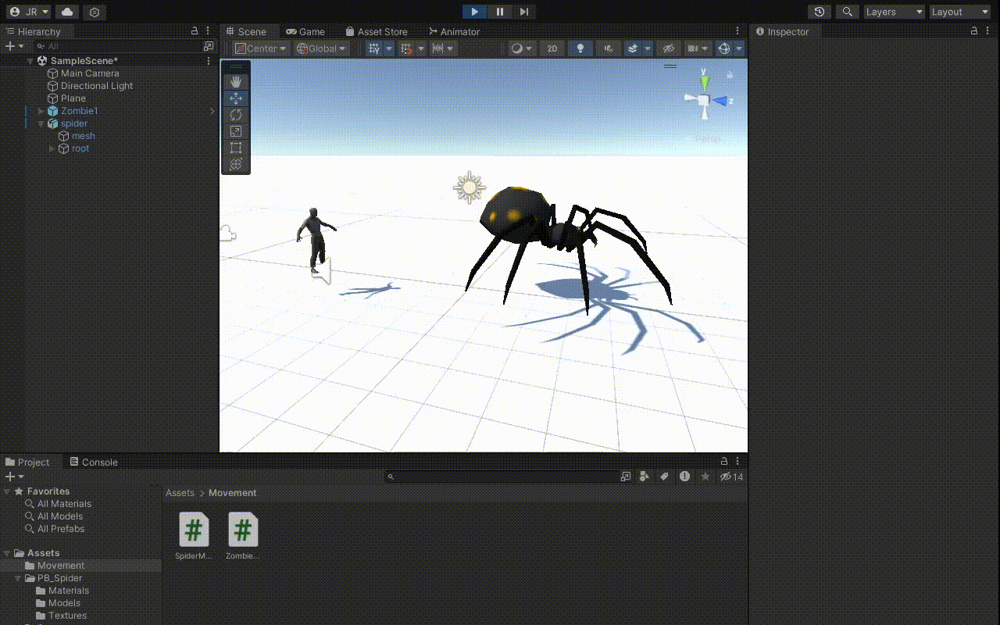
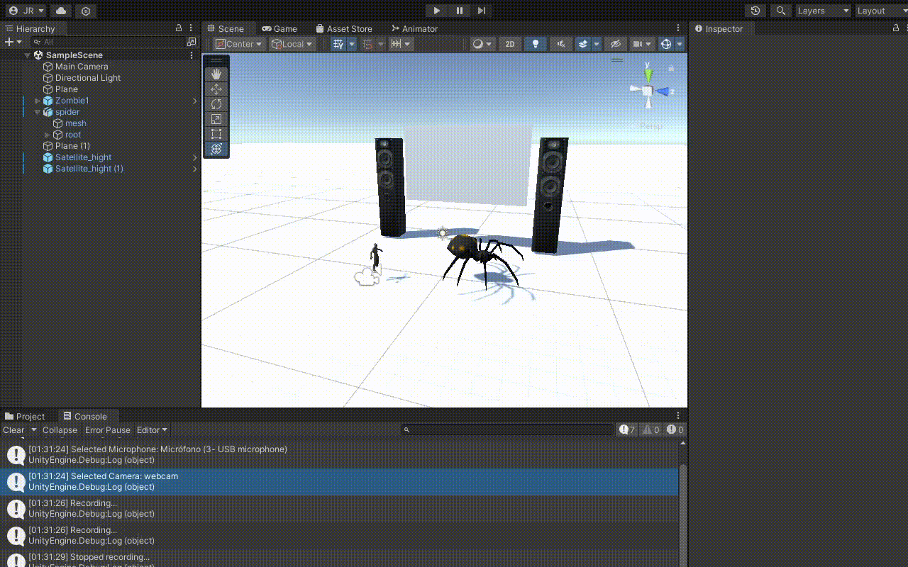
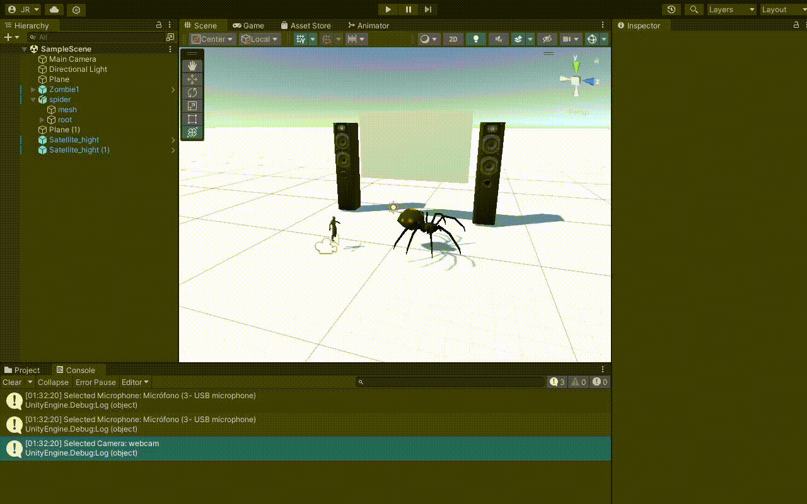

# Interfaces-Multimodales

## Ejercicio 1: Ghoul ejecutando audio al acercarse a la araña

## Ejercicio 2: Altavoces con T para grabar y R para dejar de grabar

## Ejercicio 3: Pantalla que captura la webcam. Se inicia con la tecla S, se para con la p y se toma una captura con la x.

